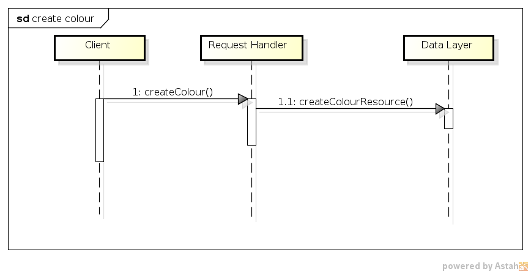

Fachhochschule Köln - Campus Gummersbach  
Web-basierte Anwendungen 2: Verteilte Systeme  

#Dokumentation 

1. [Idee](#idee)  
2. [Szenarien](#szenarien)  
    2.1. [Erstellung einer Farbe](#szenarien_farbe_erstellen)  
    2.2. [Farbe als Lieblingsfarbe festlegen](#szenarien_lieblingsfarbe_festlegen)  
    2.3. [Farbpalette erstellen](#szenarien_farbpalette_erstellen)  
    2.4. [Farbpalette als Lieblingspalette festlegen](#szenarien_lieblingsfarbpalette_festlegen)  
    2.5. [Farbe oder Farbpalette kommentieren](#szenarien_farbe_farbpalette_kommentieren)  
    2.6. [Lieblingsfarben eines Benutzers anzeigen](#szenarien_lieblingsfarben_eines_benutzers_anzeigen)  
    2.7. [Erzeugten Farbpaletten eines Benutzers anzeigen](#szenarien_erzeugten_farbpaletten_eines_benutzers_anzeigen)  
    2.8. [Anderen Benutzer abonnieren](#szenarien_anderen_benutzer_abonnieren)  

***

##Idee
Für viele Designarbeiten kann es nötig sein, bestimmte Farbkombinationen und Farbpaletten zu erstellen, die miteinander harmonieren oder zusammen ein bestimmtes Gefühl hervorrufen.
Es gibt fast endlose Möglichkeiten unterschiedliche Farben anzuordnen.
Die Idee ist es nun Menschen die Möglichkeit zu geben, solche Farbkombinationen zu erstellen und mit anderen Farb-Enthusiasten zu teilen. Damit diese Farbkombinationen und Paletten von interessierten Menschen gefunden werden können, soll es für jeden einzelnen Möglich sein, Lieblingsfarben anzugeben.
Diese Lieblingsfarben werden dann herangezogen, um die Benutzer über neue Farbkombinationen, Farbpaletten und evtl. Farbmustern zu informieren, wenn eine oder mehrere dieser Lieblingsfarben für die Zusammenstellung verwendet wurden. Ein Benutzer wird somit immer über neue Kreationen, die ihn interessieren könnten, auf dem Laufenden gehalten.
Wenn einem Benutzer eine Farbpalette oder Muster mit seiner Lieblingsfarbe gefällt, kann dieser diese ebenfalls favorisieren bzw. als eine Lieblingspalette festlegen.
Zudem ist es einem Benutzer ebenfalls gestattet Kommentare zu einer bestimmten Farbe oder Farbpalette zu hinterlassen.
Um dem Projekt zusätzlich eine leichte Note eines sozialen Netzwerks zu verleihen, können Benutzer andere Benutzer folgen und dadurch ihre Erzeugnisse abonnieren.

<a class="right" href="#top">^ top</a>

##Szenarien

###2.1 Erstellung einer Farbe
BenutzerIn A bemerkt, dass das die Platform noch über sehr wenige Farbeinträge verfügt. Er/Sie entscheidet sich einige Einträge für bekannte Farben zu erstellen.
Dazu gibt er/sie zu einer Farbe dessen Farbcode ein oder wählt sie über einen Farbwähler aus. Mit dem Absenden des Fabcodes wird auf der Platform ein eindeutiger Eintrag für diese Farbe erzeugt.
Der Eintrag wird mit dem Namen des Erzeugers verknüpft.

**Sequenz-Diagramm**

###2.2 Farbe als Lieblingsfarbe festlegen
BenutzerIn A möchte gerne eine Farbe als eine Lieblingsfarbe angeben. Dazu gibt er/sie den Farbcode der Farbe an oder wählt sie über einen Farbwähler aus.
Da die Farbe noch nicht bekannt ist und nicht bekannte Farben nicht als Lieblingsfarbe gesetzt werden können, wird für sie vorher ein neuer eindeutiger Eintrag erzeugt und mit dem Namen des Erzeugers verknüpft.
Erst jetzt kann die Farbe als Lieblingsfarbe des/der Benutzers/in gesetzt werden.

**Sequenz-Diagramm**

###2.3 Farbpalette erstellen
BenutzerIn B möchte eine neue Farbpalette erstellen und legt mindestens 3 Farben fest, da es die Mindestanzahl der Farben einer Farbpalette entspricht.
Für alle drei Farben wird der jeweilige Farbcode eingegeben oder über einen Farbwähler ausgewählt. Nach dem Zusammenstellen der Farbpalette, wird sie der Platform bekannt gemacht. Die Farbpalette wird mit dem Benutezrnamen des Erzeugers verknüpft und erhält eine eindeutige Identifizierungsnummer.
Wenn zu einer der verwendeten Farben noch kein Eintrag existiert, wird dieser automatisch erzeugt und mit dem Namen des Benutzers verknüpft.
Die Platform überprüft, gleichzeitig zum Erstellen der Farbpalette, ob eine der Farben die Lieblingsfarbe mehrerer BenutzerInnen ist und informiert diese über die soeben erzeugte Farbpalette, die deren Lieblingsfarbe verwendet.
In diesem Fall ergab die Überprüfung der verwendeten Faben, dass eine der Farben gleichzeitig die Lieblingsfarbe von BenutzerIn A ist. BenutzerIn A erhält eine Meldung bezüglich der neuen Farbpalette.

**Sequenz-Diagramm**

###2.4 Farbpalette als Lieblingspalette festlegen
BenutzerIn A gefällt eine Farbpalette so sehr, dass er/sie zu seinen/ihren Favoriten bzw. Lieblingspaletten hinzufügt.

**Sequenz-Diagramm**

###2.5 Farbe oder Farbpalette kommentieren
BenutzerIn A ist von einer Farbpalette von BenutzerIn B so begeistert, dass er/sie ein Kommentar zu dieser verfasst und hinzufügt.

**Sequenz-Diagramm**

###2.6 Lieblingsfarben eines Benutzers anzeigen
BenutzerIn B lässt sich alle Lieblingsfarben von BenutzerIn A anzeigen.

**Sequenz-Diagramm**

###2.7. Erzeugten Farbpaletten eines Benutzers anzeigen
BenutzerIn A vermutet, dass BenutzerIn B neben einer ihrer Lieblingspaletten auch weitere schöne Farbpaletten erzeugt hat. Deshalb lässt sie sich alle von BenutzerIn B erzeugten Farbpaletten anzeigen.

**Sequenz-Diagramm**

###2.8. Anderen Benutzer abonnieren
Benutzer A ist von den von BenutzerIn B erzeugeten Paletten so sehr begeistert, dass sie auch in Zukunft über Farbpaletten von BenutzerIn B benachrichtig werden will.
Deshalb abonniert sie alle Erzeugnisse von BenutzerIn B. 

**Sequenz-Diagramm**

<a href="#top">^ top</a>