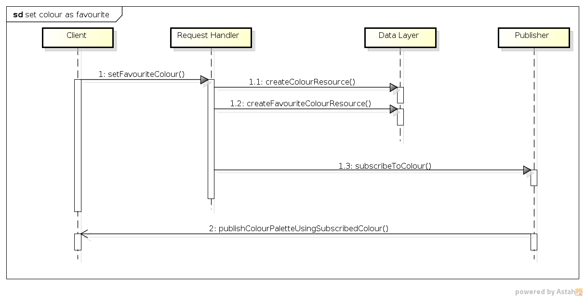
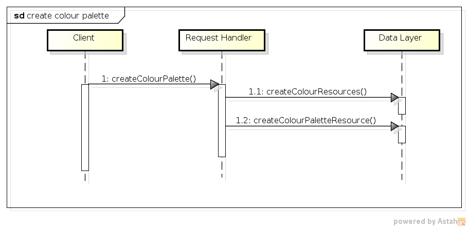
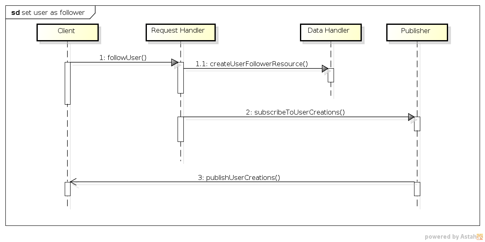

Fachhochschule Köln - Campus Gummersbach  
Web-basierte Anwendungen 2: Verteilte Systeme  

<a name="top"></a>

#Dokumentation 

1. [Idee](#idee)  
2. [Szenarien](#szenarien)  
    2.1. [Erstellung einer Farbe](#szenarien_farbe_erstellen)  
    2.2. [Farbe als Lieblingsfarbe festlegen](#szenarien_lieblingsfarbe_festlegen)  
    2.3. [Farbpalette erstellen](#szenarien_farbpalette_erstellen)  
    2.4. [Farbpalette als Lieblingspalette festlegen](#szenarien_lieblingsfarbpalette_festlegen)  
    2.5. [Farbe oder Farbpalette kommentieren](#szenarien_farbe_farbpalette_kommentieren)  
    2.6. [Lieblingsfarben eines Benutzers anzeigen](#szenarien_lieblingsfarben_eines_benutzers_anzeigen)  
    2.7. [Erzeugten Farbpaletten eines Benutzers anzeigen](#szenarien_erzeugten_farbpaletten_eines_benutzers_anzeigen)  
    2.8. [Anderen Benutzer abonnieren](#szenarien_anderen_benutzer_abonnieren)  
3. [URI- und Ressourcen-Design](#uri_ressourcen_design)  
    3.1. [Ressourcen](#uri_ressourcen_design_ressourcen)  
    3.2. [URI-Matrix](#uri_ressourcen_design_uri_matrix)  
4. [XML Schema](#xml_schema)  
    4.1. [Aufbau](#xml_schema_aufbau)  


***

##<a id="idee"></a>Idee
Für viele Designarbeiten kann es nötig sein, bestimmte Farbkombinationen und Farbpaletten zu erstellen, die miteinander harmonieren oder zusammen ein bestimmtes Gefühl hervorrufen.
Es gibt fast endlose Möglichkeiten unterschiedliche Farben anzuordnen.
Die Idee ist es nun Menschen die Möglichkeit zu geben, solche Farbkombinationen zu erstellen und mit anderen Farb-Enthusiasten zu teilen. Damit diese Farbkombinationen und Paletten von interessierten Menschen gefunden werden können, soll es für jeden einzelnen Möglich sein, Lieblingsfarben anzugeben.
Diese Lieblingsfarben werden dann herangezogen, um die Benutzer über neue Farbkombinationen, Farbpaletten und evtl. Farbmustern zu informieren, wenn eine oder mehrere dieser Lieblingsfarben für die Zusammenstellung verwendet wurden. Ein Benutzer wird somit immer über neue Kreationen, die ihn interessieren könnten, auf dem Laufenden gehalten.
Wenn einem Benutzer eine Farbpalette oder Muster mit seiner Lieblingsfarbe gefällt, kann dieser diese ebenfalls favorisieren bzw. als eine Lieblingspalette festlegen.
Zudem ist es einem Benutzer ebenfalls gestattet Kommentare zu einer bestimmten Farbe oder Farbpalette zu hinterlassen.
Um dem Projekt zusätzlich eine leichte Note eines sozialen Netzwerks zu verleihen, können Benutzer andere Benutzer folgen und dadurch ihre Erzeugnisse abonnieren.

<a class="right" href="#top">^ top</a>

##<a name="szenarien"></a>Szenarien

###<a name="szenarien_farbe_erstellen"></a>2.1 Erstellung einer Farbe
BenutzerIn A bemerkt, dass das die Platform noch über sehr wenige Farbeinträge verfügt. Er/Sie entscheidet sich einige Einträge für bekannte Farben zu erstellen.
Dazu gibt er/sie zu einer Farbe dessen Farbcode ein oder wählt sie über einen Farbwähler aus. Mit dem Absenden des Fabcodes wird auf der Platform ein eindeutiger Eintrag für diese Farbe erzeugt.
Der Eintrag wird mit dem Namen des Erzeugers verknüpft.

**Sequenz-Diagramm**


###<a name="szenarien_lieblingsfarbe_festlegen"></a>2.2 Farbe als Lieblingsfarbe festlegen
BenutzerIn A möchte gerne eine Farbe als eine Lieblingsfarbe angeben. Dazu gibt er/sie den Farbcode der Farbe an oder wählt sie über einen Farbwähler aus.
Da die Farbe noch nicht bekannt ist und nicht bekannte Farben nicht als Lieblingsfarbe gesetzt werden können, wird für sie vorher ein neuer eindeutiger Eintrag erzeugt und mit dem Namen des Erzeugers verknüpft.
Erst jetzt kann die Farbe als Lieblingsfarbe des/der Benutzers/in gesetzt werden.

**Sequenz-Diagramm**



###<a name="szenarien_farbpalette_erstellen"></a>2.3 Farbpalette erstellen
BenutzerIn B möchte eine neue Farbpalette erstellen und legt mindestens 3 Farben fest, da es die Mindestanzahl der Farben einer Farbpalette entspricht.
Für alle drei Farben wird der jeweilige Farbcode eingegeben oder über einen Farbwähler ausgewählt. Nach dem Zusammenstellen der Farbpalette, wird sie der Platform bekannt gemacht. Die Farbpalette wird mit dem Benutezrnamen des Erzeugers verknüpft und erhält eine eindeutige Identifizierungsnummer.
Wenn zu einer der verwendeten Farben noch kein Eintrag existiert, wird dieser automatisch erzeugt und mit dem Namen des Benutzers verknüpft.
Die Platform überprüft, gleichzeitig zum Erstellen der Farbpalette, ob eine der Farben die Lieblingsfarbe mehrerer BenutzerInnen ist und informiert diese über die soeben erzeugte Farbpalette, die deren Lieblingsfarbe verwendet.
In diesem Fall ergab die Überprüfung der verwendeten Faben, dass eine der Farben gleichzeitig die Lieblingsfarbe von BenutzerIn A ist. BenutzerIn A erhält eine Meldung bezüglich der neuen Farbpalette.

**Sequenz-Diagramm**



###<a name="szenarien_lieblingsfarbpalette_festlegen"></a>2.4 Farbpalette als Lieblingspalette festlegen
BenutzerIn A gefällt eine Farbpalette so sehr, dass er/sie zu seinen/ihren Favoriten bzw. Lieblingspaletten hinzufügt.

**Sequenz-Diagramm**


###<a name="szenarien_farbe_farbpalette_kommentieren"></a>2.5 Farbe oder Farbpalette kommentieren
BenutzerIn A ist von einer Farbpalette von BenutzerIn B so begeistert, dass er/sie ein Kommentar zu dieser verfasst und hinzufügt.

**Sequenz-Diagramm**


###<a name="szenarien_lieblingsfarben_eines_benutzers_anzeigen"></a>2.6 Lieblingsfarben eines Benutzers anzeigen
BenutzerIn B lässt sich alle Lieblingsfarben von BenutzerIn A anzeigen.

**Sequenz-Diagramm**


###<a name="szenarien_erzeugten_farbpaletten_eines_benutzers_anzeigen"></a>2.7. Erzeugten Farbpaletten eines Benutzers anzeigen
BenutzerIn A vermutet, dass BenutzerIn B neben einer ihrer Lieblingspaletten auch weitere schöne Farbpaletten erzeugt hat. Deshalb lässt sie sich alle von BenutzerIn B erzeugten Farbpaletten anzeigen.

**Sequenz-Diagramm**


###<a name="szenarien_anderen_benutzer_abonnieren"></a>2.8. Anderen Benutzer abonnieren
Benutzer A ist von den von BenutzerIn B erzeugeten Paletten so sehr begeistert, dass sie auch in Zukunft über Farbpaletten von BenutzerIn B benachrichtig werden will.
Deshalb abonniert sie alle Erzeugnisse von BenutzerIn B. 

**Sequenz-Diagramm**



<a href="#top">^ top</a>


##<a name="uri_ressourcen_design"></a>URI- und Ressourcen-Design


###<a name="uri_ressourcen_design_ressourcen"></a>3.1. Ressourcen
Zu aller erst ist es wichtig zu wissen, dass für Farbe-Ressourcen ihr direkter Farbcode (HTML-Farbcode) als ID verwendet werden. Die Idee dahinter ist die, dass dadurch die API besser zu verstehen und zu überblicken ist. Für sich ist ein Farbcode eindeutig und wird über mehrere Bereiche hinweg als Identifizierungsmerkmal für eine Farbe verwendet.
Für jede Farbpalette muss aber hingegen eine neue eindeutige ID vergeben werden, da sie nur umständlich anhand ihrere natürlichen Merkmale identifiziert werden kann.  
Anhand der zuvor erstellten Szenarien kann man schon einige grundlegende Ressourcen festlegen.
Darunter fallen die Ressourcen `user`, `colour` sowie `colourpalette`.
Basierend auf diesen drei Ressourcen bilden sich weitere abgewandelte Ressourcen aber auch untergeordnete Ressourcen.
Als abgewandelte Ressourcen werden die Listen gezählt. Über die Ressource `users` würde man zu einer Liste aller exitierenden Benutzer gelangen. Eine Listen-Ressource ist an dem angehangenen `s` zu erkennen.
Zu der `users`-Ressource würden sich somit noch die beiden weiteren Listen-Ressourcen `colours` und `colourpalettes` hinzugesellen.  
Da es ganz hilfreich sein kann sich alle von einem Benutzer erstellten Farbpaletten geben zu lassen, wird der Ressource `user` die Unterressource `creations` vergeben, die sich auf einen bestimmten Benutzer bezieht. Folgende URI bietet sich an `/user/<user_id>/creations`. Das `s` gibt wieder an, dass es sich um eine Listen-Ressource handelt.  
Um eine Farbe als Favorit zu setzen, würde es sich weniger anbieten dafür eine eigene First-Level-Ressource einzuführen. Es macht viel mehr Sinn das Setzen einer Lieblingsfarbe mit dem entsprechenden Benutzer zu verbinden bzw. die Verbindung zu belassen.
Hierzu wird der `user`-Ressource eine untergeordnete Ressource mit dem Namen `favouritecolour` bzw. `favouritecolour` gegeben.
Zum Hinzufügen oder Löschen einer Favorisierung, muss dennoch die ID der favorisierten Farbe oder der Farbpalette angegeben werden. Dies sieht dann wie folgt aus: `PUT /user/42/favouritecolour/333333` bzw. `PUT /user/42/favouritecolourpalette/20` oder `DELETE /user/42/favouritecolour/333333` bzw. `DELETE /user/42/favouritecolourpalette/20`.
Aber auch hier soll es möglich sein sich eine Liste von allen Lieblingsfarben und Lieblingsfarbpaletten eines Benutzers geben zu lassen. Somit würde `/user/<user_id>/favourite/colours` bzw. `/user/<user_id>/favourite/colourpalettes` eine Liste aller Lieblingsfarben bzw. -farbpaletten liefern.
Mit der Möglichkeit Kommentare zu einer Farbe oder einer Farbpalette zu verfassen, kann auch hier eine neue untergeordnete Ressource mit dem Namen "comment" eingeführt werden. Auch hier würde ein `/color/<colour_id>/comments` eine Liste aller zu der Farbe verfassten Kommentare zurückgegeben werden. Das selbe auch mit `/colourpalette/<colour_palette_id>/comments`.  
Zuletzt können Benutzer von anderen Benutzern gefolgt werden. Dazu wird die untergeordnete Ressource `follower` eingeführt, die sich auf den angegebenen Benutzer bezieht. `followers` wäre somit wieder eine Listen-Ressource, die alle Benutzer auflistet, die den besagten Benutzer folgen. `follower` erlaubt es jetzt Benutzer als Follower hinzufügen und auch wieder zu entfernen. Dazu muss die ID des Benutzers aber mit angegeben werden wie z.B. wie folgt: `PUT /user/42/follower/23` sowie `DELETE /user/42/follower/23`. 


<a href="#top">^ top</a>


###<a name="uri_ressourcen_design_uri_matrix"></a>3.1. URI-Matrix

|  | GET | PUT | POST | DELETE |
| :------- | :----------: | :--------------: | :---------------: | :-----------------: |
| /user | - | - | Benutzer erstellen | - |  
| /user/&lt;user&#95;id> | Benutzerinformationen zurückgeben | Benutzerangaben aktualisieren | - | Benutzer löschen |
| /user/&lt;user&#95;id>/creations | Liste aller Farbpaletten zurückgeben | - | - | - |  
| /user/&lt;user&#95;id>/follower/&lt;user&#95;id> | - | Benutzer als Follower hinzufügen | - | Benutzer als Follower entfernen |  
| /user/&lt;user&#95;id>/followers | Liste aller Follower zurückgeben | - | - | - |  
| /user/&lt;user&#95;id>/favouritecolour/&lt;colour&#95;id> | - | Farbe als Lieblingsfarbe setzen | - | Farbe als Lieblingsfarbe entfernen |  
| /user/&lt;user&#95;id>/favouritecolours | Liste aller Lieblingsfarben des Benutzers zurückgeben | - | - | - |  
| /user/&lt;user&#95;id>/favouritecolourpalette/&lt;colourpalette_id> | - | Farbpalette als Lieblingsfarbpalette setzen | - | Farbpalette als Lieblingsfarbpalette entfernen |  
| /user/&lt;user&#95;id>/favouritecolourpalettes | Liste aller Lieblingsfarbpaletten zurückgeben | - | - | - |  
| /users | Liste aller Benutzer zurückgeben | - | - | - |  
|  | **GET** | **PUT** | **POST** | **DELETE** |  
| /colour | - | - | Farbe erstellen | - |  
| /colour/&lt;colour&#95;id> | Angaben über die Farbe zurückgeben | - | - | - |  
| /colour/&lt;colour&#95;id>/comment | - | - | Kommentar erstellen | - |  
| /colour/&lt;colour&#95;id>/comment/&lt;comment&#95;id> | - | - | - | Kommentar löschen |  
| /colour/&lt;colour&#95;id>/comments | Liste aller Kommentare zu einer Farbe zurückgeben | - | - | - |  
| /colours | Liste aller Farben zurückgeben | - | - | - |  
|  | **GET** | **PUT** | **POST** | **DELETE** |  
| /colourpalette | - | - | Farbpalette erstellen | - |  
| /colourpalette/&lt;colourpalette&#95;id> | Informationen über die Farbpalette zurückgeben | - | - | Farbpalette löschen |  
| /colourpalette/&lt;colourpalette&#95;id>/comment | - | - | Kommentar erstellen | - |  
| /colourpalette/&lt;colourpalette&#95;id>/comment/&lt;comment&#95;id> | - | - | - | Kommentar löschen |  
| /colourpalette/&lt;colourpalette&#95;id>/comments | Liste aller Kommentare zu einer Farbplalette zurückgeben | - | - | - |  
| /colourpalettes | Liste aller Farbpaletten zurückgeben | - | - | - |   


<a href="#top">^ top</a>


##<a name="xml_schema"></a>4. XML Schema

Neben dem URI- und Ressourcen Design, muss auch das XML Schema, auf welches im Projekt sehr stark gesetzt wird, wohlüberlegt konzipiert werden.
Deshalb bietet es sich an das Schema Schritt für Schritt eine solide Basis zu definieren, auf die die restliche Struktur aufsetzt. Konkret sieht das so aus, dass die im Unterpunkt 3.1 identifizierten grundlegenden Ressourcen `user`, `colour` sowie `colourpalette` als zuvor erwähnte Basis herangezogen werden.
Sie bilden die grundlegenden Ressourcen, aus denen sich Variationen bilden. Speziell sei das Beispiel `colour` und `favourite_colour` genannt. `favourite_colour` ist an sich ebenfalls eine Ressource, die eine Ableitung von `colour` darstellt. Der einzige Unterschied besteht nur in der zusätzlichen Angabe des Zeitpunkts wann eine Farbe als Lieblingsfarbe gesetzt wurde.
Hier kann man sich leicht der Objektorientierung bedienen, speziell der Vererbung. Dies bietet sich auch sehr gut an, da ein XML Schema einem ähnliche Möglichkeiten zur Strukturierung bzw. Aufbau bietet. Hier sei auf die Möglichkeiten der Erweiterung (`extension`) und der Restriktion (`restriction`) von komplexen Typen hingewiesen. In diesem Fall setzt man aber konkret nur auf die Möglichkeit der Erweiterung, um Typen gezielt zu spezialisieren.
Neben Spezialisierungen von Typen bzw. Elementen, wird auch das Zusammenfassen von solchen Elementen zu Mengen betrachtet. Damit ist gemeint, dass ein übergeodnetes Element existiert, welches als Container fungiert. Dies kann man ganz gut mittels der Ressource `users` verdeutlichen. Die Ressource repräsentiert eine Liste die aus mehreren Farbressourcen (`colour`) besteht. Dadurch, dass es über die REST-Schnittstelle möglich ist eine Liste aller Benutzer anzufordern, bietet es sich auch an auf Seiten von XML ein Listen- bzw. Container-Element einzuführen.
Listen gibt es nicht nur für Benutzer (`users`), sondern auch zur Auflistung von Farben (`colours`), Lieblingsfarben (`favourite_colours`), Lieblingsfarbpaletten (`favourite_colourpalettes`) aber auch von Benutzern die einen bestimmten Benutzer folgen, sognannte Follower (`followers`).  
Eine Besonderheit des XML Schemas ist es, dass es Dokumente mit unterschiedlichen Wurzelelementen erfolgreich validiert. Im Gegensatz zur Phase 1, wo das konzipierte Schema nur ein Wurzelelement vorsah, ist dieses Schema der Phase 2 sehr viel flexibler gestaltet. In Phase 1 wurden die Daten so modelliert, dass eine Dokumenteninstanz wirklich alle aufgekommenen Daten enthielt. Für den Anwendungsfall ist dies sicherlich die beste herangehensweise, doch für Phase 2 nicht mehr. Hier sollten nur Daten zwischen einem Clienten und einem Server transportiert werden, die entsprechend des Kontexts relevant sind.
Mit Kontext ist hiermit die Semantik der HTTP-Operationen gemeint. Es ist somit weniger sinnvoll wenn ein Request wie z.B. `GET /user/1` einem Clienten neben den Informationen zum Benutzer mit der ID 1, auch alle anderen Informationen bzw. Daten des Systems liefert, die nichts mit der klar identifizierten Ressource zu tun hat. Es würde völlig ausreichen nur den relevanten Teil der kompletten Datenstruktur zurückzugeben. Dafür muss das Schema mit den Anwendungsfällen im Hinterkopf entsprechend ausgearbeitet werden.  
Generell ist das Schema dieses Projekts sehr modular aufgebaut und stützt sich verstärkt auf Referenzierung von Elementen. Die Idee der Referenzierung hat sich auch in die Struktur einer Dokumenteninstanz ausgebreitet. Als Beispiel soll die Ressource `colour` angeführt werden. Ein Request wie z.B. `GET /color/333333` würde sämtliche Informationen über die Farbe mit dem Farbcode `333333` liefern. Darunter fallen der Zeitpunkt wann die Ressource im System erstellt wurde, aber auch von welchem Benutzer. Anstatt sich bei einem Request neben den Farbinformationen auch alle Infromationen des Benutzers liefern zu lassen,
würde es völlig ausreichen, wenn der Benutzer nur über eine ID referenziert wird. Interessiert sich ein Client dann noch näher für den Benutzer, dann würde ein zusätzlicher Request initiiert werden, um die Benutzer-Ressource anhand der ID anzusprechen. Der Vorteil dabei ist, dass nicht unnötig Daten übertragen werden, die evtl. garnicht benötigt werden. Der Nachteil könnte in den zusätzlichen Requests gesehen werden, die das Liefern der relevanten Daten, je nach Gegebenheit des Netzes, spürbar verzögert. Es wurde sich aber bewusst für die Referenzierung bzw. "Verlinkung" von Ressourcen untereinander entschieden,
da dessen Vorteile für sich sprechen. Kleinere Datenmengen führen zu schnelleren und effizienteren Datenübertragungen. Zusätzlich erhält der Client nur die für die Operation relevanten Daten und muss sie nicht vorher in einer wohlmöglich sehr großen Datenstruktur finden und aus ihr dann noch extrahieren.  
Neben der Möglichkeit einzelne Element-Fragmente erfolgreich zu validieren, wurde das Schema um die Möglichkeit erweitert, eine größere zusammenhängende XML-Struktur zu validieren. Mit großer XML-Struktur ist eine Struktur gemeint, die alle relevanten Daten des Systems auf einmal führen kann. Die Möglichkeit der Bildung einer solchen allumfassenden Struktur, ist für die komplette Datenaufnahme wichtig. Somit gibt es auf sietens des Servers eine einzige XML-Dokumenten-Instanz, die alle Daten enthält. Es müssen somit nicht unnötig viele kleine XML-Dokumente mit Datenfragementen auf dem Data Layer organisiert werden.
Es können Vergleiche zwischen der großen XML-Dokumenten-Instanz und einer Datenbank bzw. Datenbankdatei (sqlite) gezogen werden.  
Das Hinzufügen von Daten ist so gesehen die einfachste Operation, die man implementieren kann. Schwieriger wird es dann aber, wenn es um das Löschen von Daten bzw. Datensätzen geht. Speziell Datensätze, die an einer anderern Stelle referenziert werden. Es stellt sich nun die Frage, wie mit solchen Elementen umgegangen werden soll, die nicht mehr auf ein existierendes Element referenzieren, geschweige sie als erstes zu suchen und auch zu finden. In der momentanen Form bietet es sich nur an die komplette Struktur zu traversieren und wirklich alle Elemente auf eventuelle Referenzen zu prüfen und sie ggf. zu löschen.

###<a name="xml_schema_aufbau"></a>4.1 Aufbau

```
<?xml version="1.0" encoding="UTF-8"?>
<xsd:schema xmlns:xsd="http://www.w3.org/2001/XMLSchema" xmlns:xsi="http://www.w3.org/2001/XMLSchema-instance">
    <xsd:annotation>
        <xsd:documentation xml:lang="DE">
            ColourConnection
            Jorge H. F. Pereira
            FH-Köln - Campsus GM / Web-basierte Anwendungen 2 / 2013
        </xsd:documentation>
    </xsd:annotation>
	
	
	
	<xsd:complexType name="Ref">
    	<xsd:attribute name="id" type="xsd:positiveInteger" />
		<xsd:attribute name="ref" type="xsd:string" />
    </xsd:complexType>
	
	<xsd:simpleType name="ColourID">
		<xsd:restriction base="xsd:string">
			<xsd:pattern value="[0-9a-fA-F]{6}" />
		</xsd:restriction>
	</xsd:simpleType>
	
    <xsd:complexType name="User">
    	<xsd:sequence>
    		<xsd:element name="username" type="xsd:string" minOccurs="1" maxOccurs="1" />
    		<xsd:element name="date_of_registration" type="xsd:dateTime" minOccurs="1" maxOccurs="1" />
    	</xsd:sequence>
    	<xsd:attribute name="id" type="xsd:positiveInteger" />
    </xsd:complexType>
    
    <xsd:complexType name="ColourRef">
		<xsd:attribute name="id" type="ColourID" />
		<xsd:attribute name="ref" type="xsd:string" />
    </xsd:complexType>
    
    <xsd:complexType name="Colour">
    	<xsd:sequence>
    		<xsd:element name="creator" type="Ref" minOccurs="1" maxOccurs="1" />
    		<xsd:element name="date_of_creation" type="xsd:string" minOccurs="1" maxOccurs="1" />
    	</xsd:sequence>
    	<xsd:attribute name="id" type="ColourID" />
    </xsd:complexType>
    
	<xsd:complexType name="ColourPalette">
    	<xsd:sequence>
    		<xsd:element name="creator" type="Ref" minOccurs="1" maxOccurs="1" />
    		<xsd:element name="date_of_creation" type="xsd:string" minOccurs="1" maxOccurs="1" />
    		<xsd:element name="used_colours" minOccurs="1">
    			<xsd:complexType>
    				<xsd:sequence>
    					<xsd:element name="colour" type="ColourRef" minOccurs="2" maxOccurs="10"/>
    				</xsd:sequence>
    			</xsd:complexType>
    		</xsd:element>
    	</xsd:sequence>
    	<xsd:attribute name="id" type="xsd:positiveInteger" />
    </xsd:complexType>
    
    <xsd:complexType name="FavouriteColour">
		<xsd:complexContent>
			<xsd:extension base="ColourRef">
				<xsd:sequence>
					<xsd:element name="favourite_since" type="xsd:dateTime" minOccurs="1" maxOccurs="1" />
				</xsd:sequence>
			</xsd:extension>
		</xsd:complexContent>
    </xsd:complexType>
    
	<xsd:complexType name="FavouriteColourPalette">
		<xsd:complexContent>
			<xsd:extension base="Ref">
				<xsd:sequence>
					<xsd:element name="favourite_since" type="xsd:dateTime" minOccurs="1" maxOccurs="1" />
				</xsd:sequence>
			</xsd:extension>
		</xsd:complexContent>
    </xsd:complexType>
    
    
    
    <xsd:complexType name="UserList">
    	<xsd:sequence>
    		<xsd:element name="user" type="Ref" minOccurs="0" maxOccurs="unbounded" />
    	</xsd:sequence>
    </xsd:complexType>
    
    <xsd:complexType name="ColourList">
    	<xsd:sequence>
    		<xsd:element name="colour" type="ColourRef" minOccurs="0" maxOccurs="unbounded">
    		</xsd:element>
    	</xsd:sequence>
    </xsd:complexType>
    
    <xsd:complexType name="ColourPaletteList">
    	<xsd:sequence>
    		<xsd:element name="colourpalette" type="Ref" minOccurs="0" maxOccurs="unbounded" />
    	</xsd:sequence>
    </xsd:complexType>
 
    <xsd:complexType name="FavouriteColourList">
    	<xsd:sequence>
    		<xsd:element name="favourite_colour" type="Ref" minOccurs="0" maxOccurs="unbounded" />
    	</xsd:sequence>
    </xsd:complexType>
    
    <xsd:complexType name="FavouriteColourPaletteList">
    	<xsd:sequence>
    		<xsd:element name="favourite_colourpalette" type="Ref" minOccurs="0" maxOccurs="unbounded" />
    	</xsd:sequence>
    </xsd:complexType>
    
    
    
    <xsd:complexType name="Follower">
    	<xsd:complexContent>
    		<xsd:extension base="Ref">
    			<xsd:all>
    				<xsd:element name="following_since" type="xsd:dateTime" minOccurs="1" />
    			</xsd:all>
    		</xsd:extension>
    	</xsd:complexContent>
    </xsd:complexType>
    
    <xsd:complexType name="Followers">
    	<xsd:sequence>
    		<xsd:element name="follower" type="Follower" minOccurs="0" maxOccurs="unbounded"/>
    	</xsd:sequence>
    </xsd:complexType>
    
    <xsd:complexType name="Comment">
    	<xsd:sequence>
    		<xsd:element name="creator" type="Ref" minOccurs="1" maxOccurs="1" />
    		<xsd:element name="date_of_creation" type="xsd:dateTime" maxOccurs="1"/>
    		<xsd:element name="message" type="xsd:string" minOccurs="1" maxOccurs="1" />
    	</xsd:sequence>
    	<xsd:attribute name="id" type="xsd:positiveInteger" />
    </xsd:complexType>
    
	<xsd:complexType name="Comments">
		<xsd:sequence>
			<xsd:element name="comment" type="Comment" minOccurs="0" maxOccurs="unbounded"/>
		</xsd:sequence>
	</xsd:complexType>
	
    
    
    <xsd:complexType name="ColourConnection">
    	<xsd:sequence>
    		<xsd:element name="users" minOccurs="1" maxOccurs="1">
    			<xsd:complexType>
    				<xsd:sequence>
    					<xsd:element name="user" minOccurs="0" maxOccurs="unbounded">
    						<xsd:complexType>
    							<xsd:complexContent>
    								<xsd:extension base="User">
    									<xsd:sequence>
    										<xsd:element ref="favourite_colours" minOccurs="1" maxOccurs="1"/>
    										<xsd:element ref="favourite_colourpalettes" minOccurs="1" maxOccurs="1"/>
    										<xsd:element ref="followers" minOccurs="1" maxOccurs="1" />
    										<xsd:element name="creations" type="ColourPaletteList" minOccurs="1" maxOccurs="1" />
    									</xsd:sequence>
    								</xsd:extension>
    							</xsd:complexContent>
    						</xsd:complexType>
    					</xsd:element>
    				</xsd:sequence>
    			</xsd:complexType>
    		</xsd:element>
    		<xsd:element name="colours" minOccurs="1" maxOccurs="1">
    		    <xsd:complexType>
    		    	<xsd:sequence>
    					<xsd:element name="colour" minOccurs="0" maxOccurs="unbounded">
    						<xsd:complexType>
    							<xsd:complexContent>
    								<xsd:extension base="Colour">
    									<xsd:sequence>
    										<xsd:element name="comments" minOccurs="1" maxOccurs="1">
    											<xsd:complexType>
    												<xsd:sequence>
    													<xsd:element ref="comment" minOccurs="0" maxOccurs="unbounded" />
    												</xsd:sequence>
    											</xsd:complexType>
    										</xsd:element>
    									</xsd:sequence>
    								</xsd:extension>
    							</xsd:complexContent>
    						</xsd:complexType>
    					</xsd:element>
    				</xsd:sequence>
    			</xsd:complexType>
    		</xsd:element>
    		<xsd:element name="colourpalettes" minOccurs="1" maxOccurs="1">
    		    <xsd:complexType>
    		    	<xsd:sequence>
    					<xsd:element name="colourpalette" minOccurs="0" maxOccurs="unbounded">
							<xsd:complexType>
    							<xsd:complexContent>
    								<xsd:extension base="ColourPalette">
    									<xsd:sequence>
    										<xsd:element name="comments" minOccurs="1" maxOccurs="1">
    											<xsd:complexType>
    												<xsd:sequence>
    													<xsd:element ref="comment" minOccurs="0" maxOccurs="unbounded" />
    												</xsd:sequence>
    											</xsd:complexType>
    										</xsd:element>
    									</xsd:sequence>
    								</xsd:extension>
    							</xsd:complexContent>
    						</xsd:complexType>
    					</xsd:element>
    				</xsd:sequence>
    			</xsd:complexType>
    		</xsd:element>
    	</xsd:sequence>
    </xsd:complexType>
    
    
    
    <xsd:element name="user" type="User" />
    <xsd:element name="colour" type="Colour" />
    <xsd:element name="colourpalette" type="ColourPalette" />
    <xsd:element name="favourite_colour" type="FavouriteColour" />
    <xsd:element name="favourite_colourpalette" type="FavouriteColourPalette" />
    
    <xsd:element name="users" type="UserList" />
    <xsd:element name="colours" type="ColourList" />
    <xsd:element name="colourpalettes" type="ColourPaletteList" />
    <xsd:element name="favourite_colours" type="FavouriteColourList" />
    <xsd:element name="favourite_colourpalettes" type="FavouriteColourPaletteList" />
    
    <xsd:element name="followers" type="Followers" />
    <xsd:element name="comment" type="Comment"/>
    <xsd:element name="comments" type="Comments" />

	<xsd:element name="colour_connection" type="ColourConnection" />    
    
</xsd:schema>
```


<a href="#top">^ top</a>


